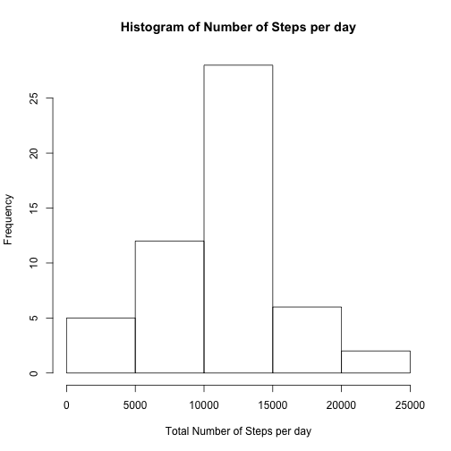
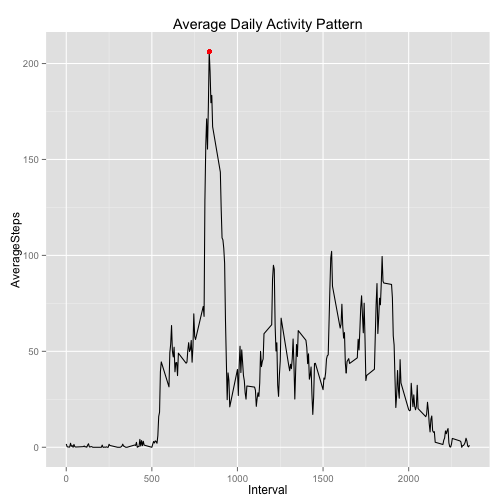
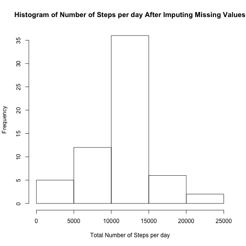
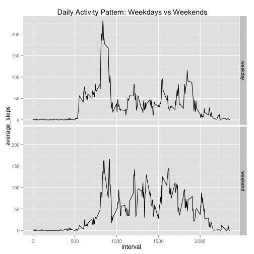

```r
opts_chunk$set(echo=TRUE)
```
# Reproducible Research - Peer Assessment1

**Dataset**: Activity monitoring data 
The variables included in this dataset are:
- steps: Number of steps taking in a 5-minute interval (missing values are coded as NA).
- date: The date on which the measurement was taken in YYYY-MM-DD format.
- interval: Identifier for the 5-minute interval in which measurement was taken.

The dataset is stored in a comma-separated-value (CSV) file and there are a total of 17,568 observations in this dataset.  

Code in the rest of the document assumes that the data file (activity.csv) is present in the current folder.  

## Loading and preprocessing the data:

```r
 activityData= read.csv('activity.csv')
 activity_clean=activityData[complete.cases(activityData), ]
```


##  Statistics on total number of steps taken per day:

```r
total_steps_by_date= aggregate(activity_clean$steps, by=list(activity_clean$date), FUN=sum)
colnames(total_steps_by_date)= c("Date","TotalSteps")
hist(total_steps_by_date$TotalSteps, main="Histogram of Number of Steps per day", xlab="Total Number of Steps per day")
```

 

```r
mean_num_steps= mean(total_steps_by_date$TotalSteps)
median_num_steps= median(total_steps_by_date$TotalSteps)
```

- **Mean** of Total number of steps per day is 1.0766189 &times; 10<sup>4</sup> .
- **Median** of Total number of steps per day is 10765.

## Average daily activity pattern:

```r
library(ggplot2)
avg_steps_by_interval= aggregate(activity_clean$steps, by=list(activity_clean$interval), FUN=mean)
colnames(avg_steps_by_interval)= c("Interval","AverageSteps")

row_with_max_avg_steps= which.max(avg_steps_by_interval$AverageSteps)
interval_with_max_avg_steps= avg_steps_by_interval[row_with_max_avg_steps,]$Interval

ggplot(data=avg_steps_by_interval, aes(x=Interval, y=AverageSteps))  + geom_line(colour="black") + ggtitle("Average Daily Activity Pattern") + geom_point(color="red", x=interval_with_max_avg_steps, y=max(avg_steps_by_interval$AverageSteps))
```

 
- **Interval which has maximum number of steps on average is** 835

## Imputing missing values:

```r
nrows_total= nrow(activityData)
nrows_clean= nrow(activity_clean)
num_rows_withNAs= nrows_total-nrows_clean
```

There are 2304 rows with missing values.
### Strategy: 
We will fill each missing value corresponding to a 5-minute interval with  average number steps across days for that 5-minute interval.
- Create a list (as a hash-table) which maps 5-minute intervals as keys to average number of steps across days for that 5-minute interval.
- Make a copy of the original activity Data. Call it 'newActivityData'. We will fill in imputed values into this dataset.
- Iterate through the table and check if 'steps' variable is 'na'. If it is 'na', get the 5-minute interval for that row and extract its corresponding average number of steps from the list created in first step.


```r
interval2average_steps_map= list()
for(i in 1:nrow(avg_steps_by_interval))
     interval2average_steps_map[as.character(avg_steps_by_interval[i,"Interval"])]= avg_steps_by_interval[i,"AverageSteps"]

newActivityData= activityData
for(j in 1:nrow(activityData))
     if(is.na(activityData[j,]$steps) )
          newActivityData[j,]$steps= interval2average_steps_map[[as.character(activityData[j,]$interval)]]

total_steps_by_date_new= aggregate(newActivityData$steps, by=list(newActivityData$date), FUN=sum)
colnames(total_steps_by_date_new)= c("Date","TotalSteps")
hist(total_steps_by_date_new$TotalSteps, main="Histogram of Number of Steps per day After Imputing Missing Values", xlab="Total Number of Steps per day")
```

 

```r
mean_num_steps_new= mean(total_steps_by_date_new$TotalSteps)
median_num_steps_new= median(total_steps_by_date_new$TotalSteps)
```
After imputing missing values as per the strategy mentioned above:
- **Mean** of Total number of steps per day is 1.0766189 &times; 10<sup>4</sup> .
- **Median** of Total number of steps per day is 1.0766189 &times; 10<sup>4</sup>.

There is not much of impact of imputing missing values on Mean and Median values. We can observe that the Mean value has not changed at all. The Median value is now equal to the mean value. 

## Difference between Activity Patterns on Weekdays and Weekends:


```r
newActivityData$day= weekdays(as.Date(newActivityData$date, format = "%Y-%m-%d"))
newActivityData$is_weekend <- ifelse((newActivityData$day=="Sunday" | newActivityData$day=="Saturday") ,"weekend", "weekday")

avg_steps_by_interval_weektype=aggregate(newActivityData$steps, by=list(newActivityData$interval, newActivityData$is_weekend), FUN=mean)
colnames(avg_steps_by_interval_weektype)=c("interval","is_weekend","average_steps")

ggplot(data=avg_steps_by_interval_weektype, aes(x=interval, y=average_steps))  + geom_line(colour="black") + ggtitle(" Daily Activity Pattern: Weekdays vs Weekends") + facet_grid(is_weekend~.)
```

 


